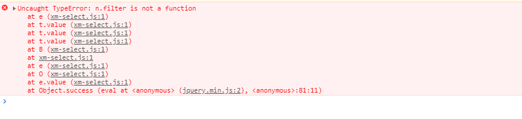

## 常见问题


### formSelects 与 xm-select

[formSelects](https://github.com/hnzzmsf/layui-formSelects/)是作者很久以前开发的一款多选插件, 在jQuery时代还是相对比较稳定, 不过性能上有很大的问题。痛并思痛后，开始学习其他开源组件的编写方案，最后决定重新开发。

[xm-select](https://gitee.com/maplemei/xm-select)作者精心二次开发的组件, 在formSelects的样式基础上进行了性能优化。目前看来还是比较稳定的 ^_^


### 1.在哪里下载

[Gitee码云下载](https://gitee.com/maplemei/xm-select/releases), 使用时引入`xm-select.js`即可, 已经内置了css, 具体请看[入门指南](/#/component/install)


### 2.为什么多选不显示

重要的事情说三遍, 需要渲染, 需要渲染, 需要渲染


### 3.渲染后还是不显示

- 打开控制台查看是否报错
- 加群: 660408068, 询问


### 4.占位标签为什么是div

演示中使用的是div, 不限制标签, 但是不建议使用`select`, 因为`layui`会渲染`select`标签


### 5.动态数据渲染报错



检查设置的data数据是否为数组类型

```
var demo1 = xmSelect.render({
	el: '#demo1', 
	data: []
})

//....N多操作以后
var arr = data;//这里的data可能是ajax返回的数据

//这里必须是 [object Array]
console.log(Object.prototype.toString.call(arr));
//如果是 [object String]
//1. JSON数据
arr = JSON.parse(arr);
//2. 类似JSON的数据
arr = eval('(' + arr + ')');

demo1.update({
	data: arr,
})


```
